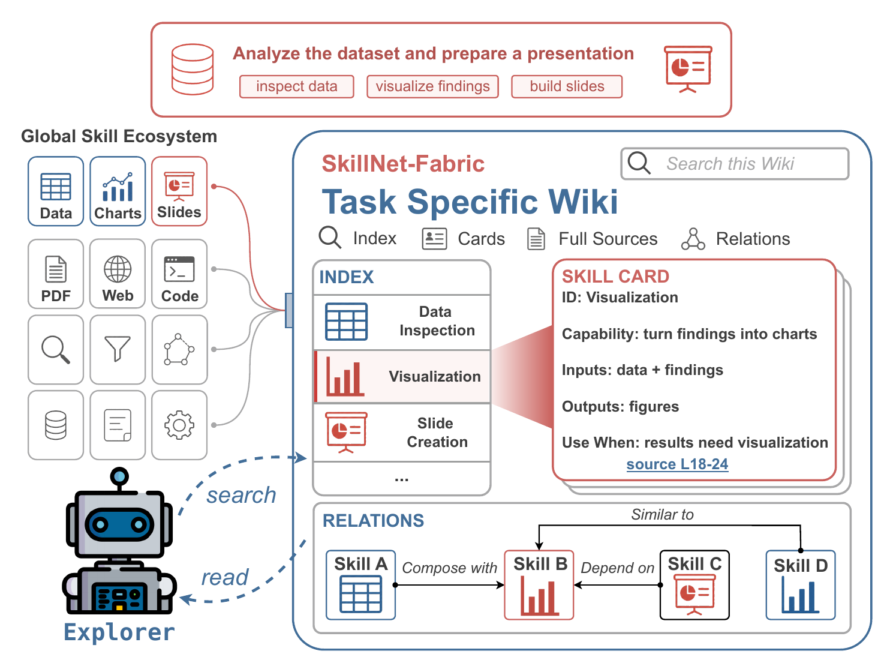

<div align="center">

# SkillFabric

**Build a local skill library once, route each task through a focused Task Wiki, and hand the right Skills to your agent.**

[](LICENSE)
[](https://www.python.org/downloads/)
[](https://github.com/zjunlp/SkillNet-Fabric)
[](https://github.com/zjunlp/SkillNet-Fabric)

[Quick Start](#quick-start) · [Python SDK](#python-sdk) · [CLI](#cli) · [Agent Integrations](#agent-integrations)

</div>

---

## Why SkillFabric?

Agents should not receive an entire skill library for every task. Sending every `SKILL.md` creates
unnecessary context, makes related Skills hard to compare, and leaves the agent to infer useful
handoffs from raw files.

SkillFabric is a local routing layer for native `SKILL.md` libraries:

- **Build once:** compile Skills into validated contracts, indexes, and a typed graph.
- **Route per task:** combine lexical retrieval, embeddings, and graph evidence to materialize a
  bounded Task Wiki.
- **Select with an agent:** let Claude Code or Codex inspect that Task Wiki and return a strict set
  of Skills with reasons and evidence.
- **Plan when needed:** optionally turn a validated route into one execution-ready prompt for a
  downstream agent.
- **Stay local:** keep source files and generated artifacts in your workspace. SkillFabric does
  not upload a skill library to a hosted registry.

The project is named **SkillFabric**. The installable package is `skillfabric-ai`, and the CLI is
`skillfabric`.

### SkillNet and SkillFabric

[SkillNet](https://github.com/zjunlp/SkillNet) is the broader supply chain for discovering,
creating, evaluating, and downloading reusable Skills. SkillFabric is the local task-time layer:
place the Skills you want to use in a local directory, run `build` once, and let `route` prepare a
focused Task Wiki for each task. The two projects can be used together without requiring a hosted
SkillFabric service.

---

## Quick Start

### Requirements

- Python 3.11 or newer.
- An LLM endpoint supported by [LiteLLM](https://docs.litellm.ai/) for `build` and optional `plan`.
- An OpenAI-compatible embedding endpoint for `build` and `route`.
- [Claude Agent SDK](https://github.com/anthropics/claude-agent-sdk-python) for the default
  Explorer, or the official Codex SDK for the Codex Explorer.

### Install

Install the published package when available:

```bash
python -m pip install "skillfabric-ai[claude]"
```

Install the current repository in editable mode:

```bash
git clone https://github.com/zjunlp/SkillNet-Fabric.git SkillFabric
cd SkillFabric/skillfabric-ai
python -m pip install -e ".[claude]"
```

Add the Codex Explorer when needed:

```bash
python -m pip install "skillfabric-ai[codex]"
```

### Prepare a Skill Library

SkillFabric reads one native `SKILL.md` from each immediate child directory of the skill root. A
single `SKILL.md` file can also be passed directly as `--skill-root`:

```text
skills/
├── data-inspection/
│   └── SKILL.md
├── visualization/
│   └── SKILL.md
└── slide-creation/
    └── SKILL.md
```

Each file must contain YAML frontmatter with a non-empty `name` and `description`, followed by the
Skill instructions. SkillFabric keeps the source intact and treats it as untrusted input during
model calls.

### Configure Providers

Keep credentials in a private, untracked `.env` file. The CLI never prints secret values:

```bash
skillfabric init --env-file .env
skillfabric init --check --json --env-file .env
```

The smallest common configuration is:

```text
API_KEY=...
BASE_URL=https://api.openai.com/v1
MODEL=openai/responses/gpt-5.4-mini
EMBEDDING_MODEL=openai/text-embedding-3-small
```

`EMBEDDING_API_KEY` and `EMBEDDING_BASE_URL` can be set separately. If omitted, the embedding
provider uses `API_KEY` and `BASE_URL`. Anthropic-compatible variables are also accepted by the
LLM configuration.

### Build and Route

```bash
skillfabric build \
  --skill-root ./skills \
  --workspace .skillfabric \
  --env-file .env

skillfabric route \
  "Analyze the dataset and prepare a presentation" \
  --workspace .skillfabric \
  --env-file .env
```

Builds are incremental by default. Re-run the same `build` command after adding, editing, or
removing `SKILL.md` files: unchanged contracts, embeddings, and relation judgments are reused,
while affected Skills and relationships are refreshed. The final graph, indexes, and Full Wiki are
validated and published as one consistent workspace.

The terminal output is designed for humans. Add `--json` when a script or plugin needs a stable
machine-readable result:

```bash
skillfabric route --json "Analyze the dataset and prepare a presentation"
```

`route` returns selected Skills and evidence. It does not execute the task.

---

## What You Can Build

| Layer | Capability | What it enables |
| :-- | :-- | :-- |
| Skill library | Compile local `SKILL.md` files | Reuse one validated library across tasks |
| Skill graph | Build typed, source-grounded relations | Retrieve useful handoffs and alternatives |
| Task routing | Materialize a bounded Task Wiki | Give an agent only task-relevant evidence |
| Agent selection | Claude Code or Codex Explorer | Return a strict, inspectable Skill selection |
| Planner handoff | Generate an execution prompt | Pass selected Skills to a downstream agent |
| Integrations | Claude Code plugin and Python API | Use the same routing workflow from common runtimes |

---

## How It Works

SkillFabric separates stable library preparation from task-time selection:

1. **Full Wiki:** a reusable, complete view of the local Skill library with deterministic Skill
   cards, complete sources, and rendered relation context.
2. **Canonical graph and indexes:** machine-facing artifacts used for hybrid retrieval and bounded
   graph expansion. They are not shown to the Explorer as an unrestricted global corpus.
3. **Task Wiki:** a per-task evidence closure containing only the candidates, cards, sources, local
   relations, and alternatives admitted for that task.
4. **Explorer:** Claude Code or Codex reads only the Task Wiki and returns the final selection.
5. **Planner:** an optional downstream stage turns a validated route into an execution prompt. It
   does not execute the task.



### Relations Are Evidence

The graph currently supports three relation types:

| Relation | Meaning | Direction |
| :-- | :-- | :-- |
| `depend_on` | A concrete artifact, data, or state handoff | Producer to consumer |
| `compose_with` | Adjacent complementary stages | Workflow predecessor to successor |
| `similar_to` | Independent alternatives for a shared subproblem | Symmetric |

Accepted relations require evidence from the Skill sources. Relations help retrieve and explain
candidates; they do not force prerequisite closure, enlarge the final selection, or dictate
execution order. SkillFabric does not claim SOTA performance or provide a formal semantic
correctness proof.

---

## Python SDK

```python
from skillfabric import SkillFabric

fabric = SkillFabric(workspace=".skillfabric", env_file=".env")
fabric.build("./skills")

route = fabric.route(
    "Analyze the dataset and prepare a presentation",
    max_selected_skills=5,
)
print([skill.skill_id for skill in route.selected_skills])
```

Use Codex as the Explorer:

```python
route = fabric.route(
    "Extract KPIs from the supplied report",
    backend="codex",
    max_selected_skills=5,
)
```

Planning is optional:

```python
package = fabric.plan("Analyze the dataset and prepare a presentation", route=route)
print(package.prompt_path)
```

Advanced integrations can pass a custom `WikiExplorerBackend` through `explorer_backend=`. The
public facade otherwise keeps provider and routing defaults stable.

---

## CLI

The CLI ships with `skillfabric-ai`:

| Command | What it does | Example |
| :-- | :-- | :-- |
| `init` | Configure or inspect provider settings | `skillfabric init --check --json --env-file .env` |
| `build` | Compile graph, indexes, and Full Wiki | `skillfabric build --skill-root ./skills` |
| `route` | Select Skills through a Task Wiki | `skillfabric route "your task"` |
| `plan` | Generate one validated execution prompt | `skillfabric plan "your task"` |
| `query-wiki card` | Inspect one Task Wiki card | `skillfabric query-wiki card <wiki> <skill-id>` |
| `doctor-state` | Report configuration and workspace readiness | `skillfabric doctor-state --json` |
| `run-state` | Find the latest finalized plan artifact | `skillfabric run-state --json` |

Normal commands print concise Rich summaries. Use `--json` for stable machine-readable output. Run
`skillfabric <command> --help` for command-specific options.

---

## Agent Integrations

### Claude Code

The bundled plugin exposes three commands:

- `/skillfabric:doctor` checks CLI configuration and workspace readiness.
- `/skillfabric:build <skill-root>` builds or incrementally refreshes the default workspace.
- `/skillfabric:route <task>` routes one task and reports selected Skills and evidence.

The plugin stops after routing. Claude Code remains responsible for loading and using the selected
native Skills. It does not execute the task, call `plan`, install hooks, or run background services.

Load a local checkout:

```bash
claude --plugin-dir /path/to/SkillFabric/plugins/claude-code/skillfabric
```

Or install it through the local marketplace:

```bash
claude plugin marketplace add /path/to/SkillFabric/plugins/claude-code
claude plugin install skillfabric@skillfabric --scope user
```

Inside Claude Code:

```text
/skillfabric:doctor
/skillfabric:build .claude/skills
/skillfabric:route Analyze the dataset and prepare a presentation
```

The plugin calls the CLI with JSON output and never reads or prints `.env` values.

### Claude Code Demo

> A short screen recording of the real Claude Code workflow will be added here: installation,
> `doctor`, incremental `build`, and task-time `route` over a local Skill library.

<!-- Replace this block with the GitHub video asset URL after recording the demo. -->

### Codex

Codex is an alternative route-time Explorer. The build pipeline is shared; only the agent that
inspects the Task Wiki changes:

```bash
python -m pip install "skillfabric-ai[codex]"
skillfabric route \
  "Extract KPIs from the supplied report" \
  --backend codex \
  --workspace .skillfabric \
  --env-file .env
```

Codex must return the same strict Skill selection contract as Claude. SkillFabric does not run the
selected Skills for either backend.

---

## Configuration

| Variable | Used by | Purpose |
| :-- | :-- | :-- |
| `API_KEY` | Build, Planner, embeddings by fallback | LLM authentication |
| `BASE_URL` | Build, Planner, embeddings by fallback | OpenAI-compatible endpoint |
| `MODEL` | Build and Planner | LLM model identifier |
| `EMBEDDING_API_KEY` | Build and Route | Optional separate embedding credential |
| `EMBEDDING_BASE_URL` | Build and Route | Optional separate embedding endpoint |
| `EMBEDDING_MODEL` | Build and Route | Embedding model identifier |
| `EMBEDDING_DIMENSION` | Build and Route | Expected vector dimension; default is `1536` |
| `SKILLFABRIC_MAX_SELECTED_SKILLS` | Route | Default maximum selected Skills; default is `8` |

Provider-specific model names and gateways may require additional variables supported by LiteLLM or
the selected agent SDK. Keep `.env` files private and out of Git.

---

## Workspace

Generated state lives under the workspace passed to the CLI or Python API:

```text
.skillfabric/
├── graph/                 # canonical graph and retrieval indexes
├── wiki/                  # reusable Full Wiki
├── runs/<trace-id>/       # Task Wiki and route or plan artifacts
└── status.json
```

Do not edit generated artifacts by hand. Rebuild a workspace when canonical validation fails.

---

## Development

Run the deterministic test and lint suite from `skillfabric-ai`:

```bash
python -m pip install -e ".[dev,claude,codex]"
python -m pytest
python -m ruff check src tests
python -m ruff format --check src tests
python -m compileall -q src
```

The published suite does not make real LLM, embedding, Claude, or Codex calls. Provider
integrations should be validated separately with a disposable Skill library.

---

## Roadmap

- Publish the first stable `skillfabric-ai` release.
- Add a recorded Claude Code walkthrough to this README.
- Expand integration examples while keeping the normal CLI surface small.
- Continue improving incremental builds and route diagnostics without exposing experiment-only
  controls to routine users.

---

## Contributing

Contributions are welcome. Keep pull requests focused, include tests for behavior changes, and
avoid committing credentials, generated workspaces, raw provider logs, or experiment outputs.

---

## Research

SkillFabric accompanies our research on Wiki-based Skill Routing. This repository focuses on the
usable open-source package; benchmark protocols, archived conditions, tables, and paper artifacts
are maintained separately from the runtime release.

---

## Citation

Citation metadata for the accompanying paper, *SkillFabric: Weaving Task-Specific Wikis for
Agentic Skill Routing*, will be added when the public author and publication details are finalized.

---

## License

SkillFabric is released under the [MIT License](LICENSE).
