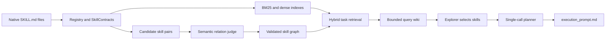

<div align="center">

# SkillNet-Fabric

**Compile native agent skills into an evidence-grounded graph, select the right skills for each task, and produce one execution-ready prompt.**

[](https://github.com/zjunlp/SkillNet-Fabric)
[](LICENSE)
[](https://www.python.org/downloads/)
[](https://github.com/zjunlp/SkillNet-Fabric)

[Quick Start](#quick-start) · [How It Works](#how-it-works) · [CLI](#cli) · [Python API](#python-api) · [Claude Code](#claude-code-plugin)

</div>

---

## Why SkillNet-Fabric?

Large skill collections create two practical problems for agents: the model cannot read every skill for every task, and file-level similarity alone does not explain how skills work together.

SkillNet-Fabric turns a local collection of native `SKILL.md` files into a reusable orchestration substrate:

- **Source-grounded compilation:** extract a strict contract from every skill and retain evidence for every accepted relationship.
- **Semantic skill graph:** distinguish prerequisites, useful compositions, close alternatives, and unrelated pairs.
- **Bounded retrieval:** combine BM25, dense embeddings, and validated operational edges without placing the full corpus in the route context.
- **Agentic selection:** let an explorer inspect a task-specific query wiki and choose the skills needed for the current task.
- **Prompt-only planning:** give the planner the selected contracts and complete skill sources, then produce one validated `execution_prompt.md`.
- **Explicit failure:** malformed model output, incompatible artifacts, missing credentials, and context overflow stop the workflow instead of silently generating a fallback.

The repository is named **SkillNet-Fabric**. Its installable Python package remains `skillfabric-ai`, and its CLI command remains `skillfabric`.

---

## Quick Start

### Requirements

- Python 3.11 or newer.
- An LLM endpoint supported by LiteLLM for graph compilation and prompt planning.
- An OpenAI-compatible embedding endpoint.
- A Claude Agent SDK-compatible gateway for query-wiki exploration.

### Install

From the repository:

```bash
git clone https://github.com/zjunlp/SkillNet-Fabric.git
cd SkillNet-Fabric/skillfabric-ai
python -m pip install -e ".[claude]"
```

Or install the packaged distribution:

```bash
python -m pip install "skillfabric-ai[claude]"
```

### Configure

Create a private, untracked environment file and verify that the required fields are available:

```bash
skillfabric init --env-file .env
skillfabric init --check --json --env-file .env
```

The interactive command does not echo secret input. Do not commit `.env` files.

### Build, Route, and Plan

```bash
skillfabric build \
  --skill-root /path/to/skills \
  --workspace .skillfabric \
  --env-file .env

skillfabric route \
  "Summarize this repository and identify release risks" \
  --workspace .skillfabric \
  --env-file .env

skillfabric plan \
  "Summarize this repository and identify release risks" \
  --workspace .skillfabric \
  --env-file .env
```

`plan` can perform routing itself, so the shortest complete workflow is `init`, `build`, then `plan`.

> [!NOTE]
> Build, route, and plan use external model services. Start with a small skill corpus when validating a new endpoint or estimating cost.

---

## How It Works



### 1. Compile the Skill Corpus

The build pipeline:

1. Scans native skill directories and parses `SKILL.md` files.
2. Extracts one strict `SkillContract` per skill from the complete source.
3. Builds BM25 and contract-aware dense indexes.
4. Retrieves bounded candidate pairs from handoff intent, similarity, and explicit references.
5. Judges each candidate once and requires source evidence for every accepted edge.
6. Validates relation direction, uniqueness, and dependency acyclicity.
7. Materializes the graph, wiki, metrics, and usage artifacts.

Optional wiki summaries are controlled independently with `--wiki-summary-mode off|all`. Disabling them does not skip contract extraction, semantic relation judgment, or embeddings.

### 2. Model Skill Relationships

| Relation | Meaning | Direction |
| :-- | :-- | :-- |
| `depend_on` | A concrete artifact, data, or state handoff | Producer → consumer |
| `compose_with` | Adjacent complementary stages in a reusable workflow | Workflow predecessor → successor |
| `similar_to` | Strict near alternatives for the same subproblem | Symmetric; canonical id order |

Candidate pairs without sufficient evidence are rejected and do not become graph edges. The graph supplies evidence to routing and planning; it does not force prerequisite closure, automatically enlarge the selected set, or dictate the final execution order.

Workspaces built with the previous relation direction are rejected and must be rebuilt; the runtime does not reinterpret legacy edges.

### 3. Route Through a Query Wiki

For each task, the router fuses BM25 and dense ranks, expands only bounded `depend_on` and `compose_with` neighborhoods, and writes a task-specific query wiki. Dependency propagation is bidirectional; workflow propagation favors predecessor-to-successor traversal. The explorer can inspect only this bounded workspace and returns a strict selection-only `SkillPackage` with cited pages.

`similar_to` relationships expose near alternatives but do not drive operational graph expansion.

### 4. Generate the Execution Prompt

The planner receives:

- the original task,
- the explorer's selected skills,
- relevant graph evidence,
- each selected `SkillContract`, and
- the complete source of every selected skill.

It decides the task-specific execution flow and writes one `execution_prompt.md`. SkillNet-Fabric does not create an intermediate workflow DAG or execute the task from the CLI.

---

## CLI

| Command | Purpose | Example |
| :-- | :-- | :-- |
| `init` | Configure or inspect API settings | `skillfabric init --check --json --env-file .env` |
| `build` | Compile graph, indexes, and wiki artifacts | `skillfabric build --skill-root ./skills` |
| `route` | Retrieve candidates and select skills for a task | `skillfabric route "your task"` |
| `plan` | Generate a validated execution prompt | `skillfabric plan "your task"` |
| `query-wiki card` | Print one manifest-listed query-wiki card | `skillfabric query-wiki card <wiki> <skill-id>` |
| `doctor-state` | Report plugin and workspace readiness | `skillfabric doctor-state --workspace .skillfabric` |
| `run-state` | Resolve the latest finalized execution package | `skillfabric run-state --workspace .skillfabric` |

Use `skillfabric help workflow` for the short workflow or `skillfabric <command> --help` for all options.

---

## Python API

The public facade exposes the same `build`, `route`, and `plan` stages:

```python
from skillfabric import SkillFabric

task = "Summarize this repository and identify release risks"
fabric = SkillFabric(workspace=".skillfabric", env_file=".env")

fabric.build("/path/to/skills")
route = fabric.route(task, max_selected_skills=8)
package = fabric.plan(task, route=route)

print([skill.skill_id for skill in route.selected_skills])
print(package.prompt_path)
```

Planning checks its estimated prompt size before calling the model. Increase `planner_context_max_tokens` only when the configured model can accept the larger context.

---

## Claude Code Plugin

The bundled plugin provides four user-facing commands:

- `/skillfabric:doctor` checks CLI, API, and workspace readiness.
- `/skillfabric:build` compiles a skill corpus.
- `/skillfabric:prepare` creates a validated route and execution prompt, then stops.
- `/skillfabric:run` prepares or reuses a prompt and executes it in the active Claude Code session.

Load the plugin directly from a clone:

```bash
claude --plugin-dir /path/to/SkillNet-Fabric/plugins/claude-code/skillfabric
```

Then run:

```text
/skillfabric:doctor --workspace .skillfabric
/skillfabric:build .claude/skills --workspace .skillfabric
/skillfabric:prepare "Summarize this repository and identify release risks" --workspace .skillfabric
```

See the [plugin guide](./plugins/claude-code/skillfabric/README.md) for installation, security boundaries, and troubleshooting.

---

## Configuration

| Variable | Purpose | Default |
| :-- | :-- | :-- |
| `API_KEY` | LLM authentication | unset |
| `BASE_URL` | LLM endpoint used by LiteLLM and the SDK adapter | `https://api.openai.com/v1` |
| `MODEL` | Contract, relation, and planner model | `openai/responses/gpt-5.4-mini` |
| `EMBEDDING_API_KEY` | Embedding authentication; falls back to `API_KEY` | unset |
| `EMBEDDING_BASE_URL` | OpenAI-compatible embedding endpoint; falls back to `BASE_URL` | provider default |
| `EMBEDDING_MODEL` | Embedding model identifier | `openai/text-embedding-3-small` |
| `EMBEDDING_DIMENSION` | Embedding vector dimension | `1536` |
| `SKILLFABRIC_MAX_SELECTED_SKILLS` | Maximum explorer selection size | `8` |
| `SKILLFABRIC_SEED_LIMIT` | Hybrid retrieval seed count | `8` |
| `SKILLFABRIC_EXPANDED_LIMIT` | Maximum candidates after graph expansion | `100` |
| `SKILLFABRIC_MAX_GRAPH_DEPTH` | Operational graph traversal depth | `2` |
| `SKILLFABRIC_WIKI_SUMMARY_MODE` | Wiki summary mode: `off` or `all` | `off` |

Project-specific LLM aliases such as `SKILLFABRIC_LLM_API_KEY`, `SKILLFABRIC_LLM_API_BASE`, and `SKILLFABRIC_LLM_MODEL` are also supported. CLI flags override routing defaults where an equivalent option exists.

---

## Workspace Artifacts

SkillNet-Fabric writes generated state under the configured workspace:

```text
.skillfabric/
├── graph/
│   ├── registry.jsonl
│   ├── contracts.jsonl
│   ├── relation_decisions.jsonl
│   ├── graph.json
│   ├── bm25.sqlite
│   └── embeddings.json
├── wiki/
│   ├── index.md
│   ├── skills/
│   └── workflows/
├── reports/
│   ├── build_summary.json
│   └── llm_usage.jsonl
├── runs/<trace-id>/
│   ├── query.json
│   ├── query_wiki/
│   ├── route.json
│   └── execution_package/
│       ├── planner_validation.json
│       └── execution_prompt.md
└── status.json
```

Artifacts are versioned and validated. Use a new workspace when the CLI reports an incompatible schema instead of mutating generated files by hand.

---

## Repository Layout

```text
SkillNet-Fabric/
├── skillfabric-ai/                  # Python package, CLI, and tests
├── plugins/claude-code/skillfabric/ # Claude Code plugin
├── README.md
└── LICENSE
```

---

## Development

```bash
git clone https://github.com/zjunlp/SkillNet-Fabric.git
cd SkillNet-Fabric/skillfabric-ai
python -m pip install -e ".[dev,claude]"

python -m compileall -q src tests
python -m pytest -q
python -m ruff check src tests
python -m ruff format --check src tests
python -m build
```

Deterministic unit tests do not require real model calls. Real API and Claude SDK checks are opt-in and should use a small disposable skill corpus.

Contributions should keep public interfaces stable, include focused tests, and avoid committing credentials, generated workspaces, or run artifacts.

---

## License

SkillNet-Fabric is released under the [MIT License](LICENSE).
